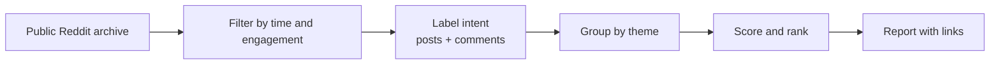

<div align="center">

# Reddit Growth Miner

**Find out what people on Reddit want to buy, switch away from, or hack together themselves. Every finding links back to the thread.**


[](LICENSE)

</div>

---

## What it does

Give it a market and a few subreddits. It reads recent public posts and comments, then tells you:

- 🛒 **Who wants to buy:** "willing to pay", "budget is $50", "any recommendations?"
- 🔀 **Who is switching:** "switched from Jira to Linear", "alternative to Notion?"
- 🩹 **Who is hacking around a problem:** spreadsheets, copy-paste, manual steps
- 📊 **Which themes repeat** across threads and communities, ranked, with a cheap experiment to test each one

It only reads. It never posts, messages, or votes.

## Quick start

```bash
git clone https://github.com/JacobTheJacobs/reddit-growth.git
cd reddit-growth

# 1. Scan
python3 scripts/reddit_growth_miner.py scan \
  --target "project management tools" \
  --subs projectmanagement,SaaS,agile \
  --competitors "Jira,Linear,Asana,Trello" \
  --fetch-comments \
  --out scan.json

# 2. Read the report
python3 scripts/reddit_growth_miner.py report --input scan.json --out report.md
```

Python 3.10+, nothing to install. Or run `pip install .` to get a `reddit-growth-miner` command.

## What you get

```text
## Candidate growth opportunities
### switching — score 6.52 (medium confidence)
- Demand threads: 3 across 2 communities
- Next test: Build a migration guide or importer from Jira.
  Success: 10 completed imports in 30 days. Kill: traffic but no imports.

## Competitor landscape
| Tool   | Threads mentioning |
| Jira   | 3 |
| Linear | 2 |
- Jira → Linear ×2  [1] [2]
```

Full example: [`examples/sample-report.md`](examples/sample-report.md) · raw JSON: [`examples/sample-output.json`](examples/sample-output.json)

## Commands

| Command | What it does |
|---|---|
| `plan --target "..."` | Suggest subreddits for a market |
| `scan --target "..." --subs a,b,c` | Collect and analyse posts → JSON |
| `report --input scan.json` | Turn a scan into a Markdown report |
| `diagnose` | Check the data sources are reachable |

### Useful `scan` options

| Option | Default | Meaning |
|---|---|---|
| `--hours` | `168` | How far back to look |
| `--competitors` | — | Tools to track, with optional aliases: `"Linear=linear.app\|Linear App,Jira"` |
| `--fetch-comments` | off | Also analyse replies, often where the best evidence is |
| `--intents` | all | Keep only some signals, e.g. `alternative_search,purchase_intent` |
| `--min-score` / `--min-comments` | `5` / `3` | Skip low-engagement posts |
| `--max-pages` | `10` | Up to 100 posts per page per subreddit |
| `--rules` | built-in | Your own rule file (copy [`rules/default.json`](reddit_growth_miner/rules/default.json)) |

## How it works



- **Labels** are plain regex rules you can read and edit. A post can have several labels. Promotional posts never count as demand.
- **Scores** reward repeated demand across different subreddits and recent threads. Engagement is compared within each subreddit, so small communities aren't drowned out by large ones.
- **Confidence** (`low` / `medium` / `high`) tells you how hard you can lean on a theme. `low` means "worth reading", not "a market".

Data comes from the [Arctic Shift](https://arctic-shift.photon-reddit.com) archive, with [PullPush](https://pullpush.io) as a fallback. If a source blocks or rate-limits, the tool stops using it and says so in the report.

## Ground rules

- ✅ Public posts only. Author names are dropped.
- ✅ Every claim keeps its Reddit link so you can check it.
- ❌ No auto-posting, DMs, fake accounts or vote manipulation.
- ❌ No proxy rotation or getting around blocks.

A cluster is evidence worth reading, not proof that a market exists.

## Use it with an AI agent

[`SKILL.md`](SKILL.md) turns this into an agent skill: gather evidence, read the threads, then propose one small experiment with a success metric and a kill condition.

## Development

```bash
python3 -m unittest discover -s tests -t tests
```

The code is split into swappable parts (data source, classifier, renderer), each behind a small interface. See [`reddit_growth_miner/`](reddit_growth_miner/).

## License

[MIT](LICENSE) © JacobTheJacobs
